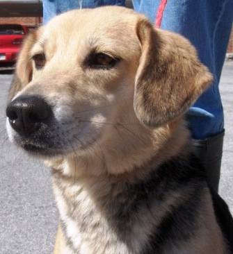

    
	
	

 

  
<h3 align="center">LimnPet</h3>
Cartoon stylization service project
  

    <a href="https://www.limnpet.ml/service"><strong>Try our service »</strong></a>
     
     
    <a href="https://www.limnpet.ml/">Home page</a>
    ·
    <a href="https://limnpet.notion.site/LimnPet-537f6461d3234937ab94dee11671d22a">Team notion</a>
    ·
    <a href="#Team-members">Members</a>
  

  
목차

  <ol>
    <li>
      <a href="#About-the-Project">프로젝트 소개</a>
      <ul>
        <li><a href="#Goals-of-LimnPet-Project">프로젝트 목표</a></li>
        <li><a href="#Used-Tech-stack-&-Tools">사용한 기술스택과 수행도구 </a></li>
        <li><a href="#Team-members">팀원</a></li>
      </ul>
    </li>
    <li>
      <a href="#Implementation-Features">구현 기능</a>
      <ul>
        <li><a href="#Key-Features">주요 기능</a></li>
        <li><a href="#Additional-Features">추가 기능</a></li>
      </ul>
    </li>
    <li><a href="#How-to-use">사용 방법</a></li>
    <li><a href="#Service-Demonstration-Video">서비스 시연 영상</a></li>
    <li><a href="#Roadmap">로드맵</a></li>
    <li><a href="#contributing">기여하기</a></li>
    <li><a href="#contact">연락처</a></li>
    <li><a href="#acknowledgments">참고 자료 및 코드 출처</a></li>
  </ol>

 

## About the Project

 

 <b>LimnPet은 커스텀 굿즈 제작 과정 간 따로 그림 서비스를 받아야 하는 불편함을 해소하기 위한  GAN 기반 반려견 그림 자동 생성 및 저장/공유 서비스입니다.</b>

 
 

> 최근 성장하는 반려동물 시장과 반려동물을 가족 구성원으로 인식하고 감정을 가진 하나의 인격체로 대우하는 현상인 '펫 휴머나이제이션' 트렌드가 확산되고 있습니다. 따라서 개성을 중요하게 생각하는 MZ세대의 반려인은 반려동물 옷이나 액세서리를 통해 일명 ‘펫 부심’을 드러내려 합니다.
>
> 만약 고객이 반려견 사진을 원본 그대로 이용하지 않고, 캐릭터화한 반려견 그림이나 초상화를 이용하여 커스텀 굿즈 제작을 의뢰하기 위해서는 상품 제작과는 별개로 그림을 그려주는 서비스를 받아야 합니다.
>
> 하지만 고객의 입장에서 이러한 과정은 매우 번거롭고 비용도 많이 들 수 있다는 단점이 존재합니다.

 
 
 
<b>Here's Insight 😊</b>

 

 

- 굿즈 제작을 위한 그림 서비스를 전문가의 수작업이 필요하지 않도록 자동화합니다.
- 생성된 이미지를 기반으로 반려견 커스텀 굿즈(의류, 휴대폰 악세서리, 생활용품, 기타 등등)를 제작할 수 있도록 관련 업체와 사용자간 의사소통 채널을 형성합니다.
- 이원화된 서비스 제공으로 인한 <u>고객의 불편함을 감소</u>시키고 <u>굿즈 제작에 대한 접근성을 높일 수 있습니다</u>.
   
   

	<a>
    	
    	
    	  
    	<i>더 자세한 프로젝트 소개와 문제 정의는 »</i>
        <a href="https://limnpet.notion.site/1-1-3076b068c2ee4f8986312c65a18ac6ac">Team notion</a> 에서.. 
  	</a>

  

### Goals of LimnPet Project

 

- 이제는 가족의 구성원인 나의 반려동물만을 위한 카툰/그림 형식의 캐릭터 생성
- 높은 비용과 오랜 제작기간이 필요한 수작업 반려동물 굿즈의 문제점을 해결
  - 전문가의 작업이 필요했던 반려동물 캐릭터화 또는 그림을 자동하여 비용과 시간을 절약
  - 생성된 이미지를 커스터마이징 굿즈 제작 업체에 제공하여 손쉽게 나만의 굿즈 구매
- 반려동물과 커스터마이징 업체 중개를 통해 **반려동물 관련 새로운 시장 및 문화를 형성**

  

### Used Tech stacks & Tools

 

 

 

 
    

 

  

### Team members

 

<table align=center>
  <tr>
    <td align="center">
      <a href="https://github.com/LiJell">
        
         
        김한주
      </a>
    </td>
    <td align="center">
      <a href="https://github.com/kkally">
        
         
        김민지
      </a>
    </td>
    <td align="center">
  <a href="https://github.com/yeonjaee">
        
         
        성연재
      </a>
    </td>
    <td align="center">
      <a href="https://github.com/dodo-Riley">
        
         
        송종호
      </a>
    </td>
    <td align="center">
      <a href="https://github.com/gannak1">
        
         
        정영훈
      </a>
    </td>
  </tr>
</table>
    

## Implementation Features

### Key Features

✔ 반려견 사진 업로드 또는 촬영 및 원하는 스타일 선택 
✔ 학습된 모델을 통해 사진을 그림으로 변환 
✔ 변환된 이미지 화면 표시 및 저장/공유 여부 확인 
✔ 사용자 요청에 따른 이미지 저장/공유 혹은 화면 초기화 
✔ 이미지 변환에 대한 사용자 반응 및 피드백 수집을 위한 댓글 페이지 제공 
✔ 변환 이미지를 활용해 굿즈를 제작할 수 있는 업체 목록 표시 
✔ 사용자가 선택한 업체 페이지로 이동 
  

### Additional Features

⊕ 사진 전체가 아닌 반려견 영역만 따로 추출하여 이미지 변환 
⊕ 저화질 이미지 화질 개선 
⊕ 글로벌 웹페이지 사이트 지원(Korean, English, Japanese, Spanish, Chinese)

    

## How to use

    1. <a href="https://www.limnpet.ml/">홈페이지 접속</a> 방법 
    &nbsp;&nbsp;1️⃣ Service 페이지 접속 
    &nbsp;&nbsp;2️⃣ 스타일 선택 및 이미지 업로드 
    &nbsp;&nbsp;3️⃣ Draw picture 버튼 클릭 또는 Improve resolution 버튼 클릭 
    &nbsp;&nbsp;4️⃣ 출력/결과 이미지 저장 
    &nbsp;&nbsp;5️⃣ 굿즈 사이트에서 주문 의뢰 
 
 
2. 로컬 서버 실행 방법 
	&nbsp;&nbsp;1️⃣ app.py 파일 실행 
    &nbsp;&nbsp;2️⃣ localhost 주소로 접속 
	&nbsp;&nbsp;3️⃣ 위의 과정과 동일 

    

## Service Demonstration Video

  
   
  
 <i>사진을 클릭해주세요</i> 

    

## Roadmap

**1st. iteration**

- [x] 데이터셋 수집 및 CartoonGAN 모델 학습

- [x] CartoonGAN 모델을 이용하여 반려견 사진을 Cartoon화

- [x] return 이미지를 웹에 post

- [x] 소셜 네트워크 기능 추가(댓글 기능, SNS 공유기능)

- [x] 웹 배포
 

 

**2st. iteration**

- [x] segmantation 모델을 추가. 이미지에서 반려견만을 추출하여 Cartoon화

- [x] 웹 페이지 UI 추가 및 개선

- [x] 굿즈 제작 회사 사이트 추가

- [ ] 굿즈 제작 사업자 정보 제공, 사진을 굿즈 사업자에게 전달
   
  

 

**3st. iteration**

- [x] Plan1) ReactNative를 이용한 앱 개발

- [ ] Plan2) PWA를 이용한 앱 개발

- [x] 앱 마켓 출시 준비 (Google Play)

- [x] 앱 Open testing release 대기

 

**TODO list in the near future:**

- [ ] 이미지 분할 기능 분리

  - 사용자가 직접 배경을 미리 제거한 사진을 그대로 이용할 수 있도록 해당 기능 분리

  - 기능 분할 시, 아래와 같은 이점이 존재
    - 분할 모델이 반려견을 제대로 인식하지 못한 경우에 대한 결과 방지
    - 사용자가 배경을 포함한 이미지를 변환하길 원하는 경우에 대한 선택권 제공

- [ ] 이미지 변환과 해상도 개선 기능 통합

  - 저화질의 이미지가 필요한 경우는 존재하지 않음

  - 현 프로젝트에서는 서버 자원 문제로 해당 기능들을 분할했으나, 실제로는 통합이 필요

- [ ] cartoonGAN 모델 성능 평가 및 개선

  - 충분하지 못한 학습으로 인해 이미지 일부만 변환되는 결과가 존재, 학습 횟수를 늘려 모델의 안정성 확보 필요

  - 현 프로젝트에서는 객관적인 모델 평가 지표에 대한 성능 평가가 이루어지지 않았으므로, 최근 GAN 모델의 평가 지표 관련 연구를 참고해 객관적인 평가 필요

- [ ] 커뮤니티 및 갤러리 기능 추가

  - 사용자들이 저장한 결과 이미지들을 타 플랫폼이 아닌 웹 페이지 내에서 서로 공유할 수 있도록 커뮤니티 및 갤러리 기능을 추가

  - 사용자 잔존율 향상 기대

- [ ] 반려동물 범위 확장
  - 고양이, 앵무새 등 다양한 반려동물에 대해 서비스 범위 확대

- [ ] 굿즈샵들과의 연계를 통한 거래 중개 역할 강화

  - 각 업체와의 연계를 통해 범위를 확장시켜, 단순 목록 제공이 아닌 굿즈 제작 및 결제까지 페이지 내에서 수행할 수 있도록 웹 페이지 개선

  - 업체별 리뷰 및 평점 기능을 구현해 사용자와 굿즈 업체 간 의사소통 채널 형성 기반 마련

- [ ] 부가 서비스 제공
  - 아래 예시와 같은 다양한 부가 서비스 추가 제공
    - 그림 이모티콘화
    - 유명 작가 및 굿즈샵과의 연계를 통한 자체 제작 굿즈 판매
    - 사용자가 직접 자신의 반려견을 이용한 굿즈를 만들어 거래

    

## Contributing

이 프로젝트의 서비스 모델을 개선할 수 있는 제안이 있다면, repo를 전환하고 pull 요청을 해주세요. 
또한 Issues 에서 "enhancement" 태그로 간단히 issue를 열어보고 기능 추가를 해보실 수 있습니다. 이 프로젝트에 별을 주는 것도 잊지 마세요. 감사합니다!

 

1. Fork the Project
2. Create your Feature Branch (`git checkout -b feature/AmazingFeature`)
3. Commit your Changes (`git commit -m 'Add some AmazingFeature'`)
4. Push to the Branch (`git push origin feature/AmazingFeature`)
5. Open a Pull Request

    

## Contact

Team e-mail: allislijell@gmail.com

Members's e-mail

- Hanju Kim: hanjukim0922@gmail.com
- Minji Kim: vp9397@naver.com
- Yeonjae Sung: siriyay@naver.com
- Jongho Song: sjh7397@naver.com
- YeongHoon Jeong: gi93008@naver.com

Project Link: [Github](https://github.com/LiJell/Final-pjt), [Notion](https://limnpet.notion.site/LimnPet-537f6461d3234937ab94dee11671d22a)

    

## Acknowledgments

- [cartoonGAN](https://github.com/mnicnc404/CartoonGan-tensorflow)
- [semantic segmentation](https://github.com/kairess/semantic-segmentation-pytorch)
- [Real_esrGAN](https://github.com/xinntao/Real-ESRGAN)

(<a href="#top">back to top</a>)

